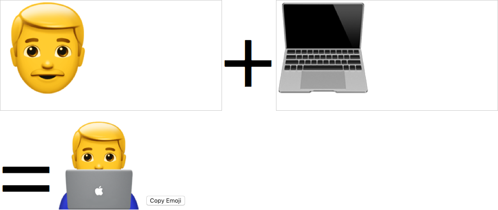

# emoji-zero-width-joiner
Fun with Emojis and zero width joiner

Some [Emoji sequences](https://emojipedia.org/emoji-zwj-sequences/) joined together with the [Zero Width Joiner](https://en.wikipedia.org/wiki/Zero-width_joiner) result in a new Emojis!

Check out the index.html file.

So much fun! 😁

See it live on [GitHub Pages](https://pkcpkc.github.io/emoji-zero-width-joiner/).
